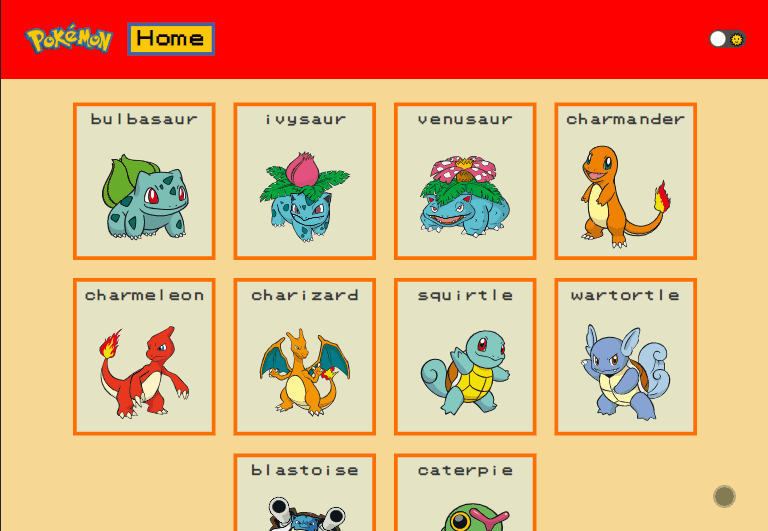
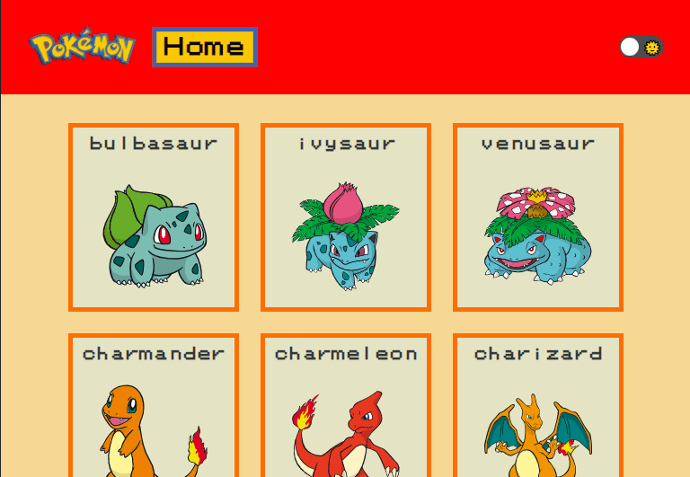
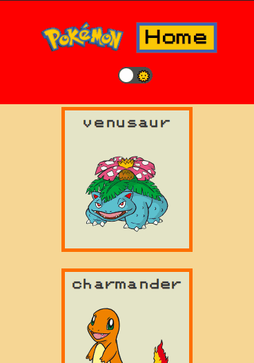

# Pokemons-API

 - O propósito desse projeto foi criar uma página que consome uma API para exibir uma lista de 10 pokémons. Para carregar mais 10 pokémons, basta clicar no botão "Veja mais". Ao clicar em um pokémon, serão exibidas todas as informações detalhadas sobre ele, como tipo, movimentos e até mesmo habilidades e descrição. Além disso, há a opção de modo escuro tanto na página inicial quanto nas informações do pokémon selecionado.
 
## Visualização do projeto

### Desktop


### Tablet


### mobile


## Ferramentas ultilizadas

- React.js

- React router dom

- Context API

- Styled Components

## Decisões adotadas

- Uma das principais decisões que eu queria aplicar no projeto é torná-lo bem organizado, com uma fácil leitura e entendimento.

- Eu queria que o estilo do projeto fosse retrô, para dar um ar de nostalgia ao usuário.

## Passo a passo pra rodar o projeto na sua própria maquina

- Baixe o arquivo .Zip ou de um "git clone"

- Na pasta do projeto baixado execute o Git Bash e digite o seguinte comando:

    `````
        npm install
    `````

- Depois que terminar a instalação digite o seguinte comando:

    ````
        npm start
    ````